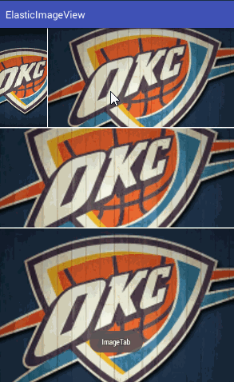

# ElasticImageView
##### 非常方便的实现类似win8磁贴的点击效果
#### 效果预览



### Gradle
```
dependencies {
    compile 'com.app.fan:elastic-imageview:1.0.1'
}
```

### 使用方法
添加Gradle依赖，布局中引入
```
 <com.app.fan.elastic_imageview.ElasticImageView
        android:id="@+id/iv_ela"
        android:layout_width="80dp"
        android:layout_height="80dp"
        app:scalevalue="0.8"
        android:src="@mipmap/ic_launcher"/>
```
修改scalevalue属性可以改变按下去缩放的范围

点击事件由于onClick与onTouch冲突，新增一个接口setOnImageTabListener,使用此接口做点击操作
```
   iv_ela.setOnImageTabListener(new ElasticImageView.OnImageTabListener() {
            @Override
            public void OnImageTab() {

            }
        });

```

## License

```
Copyright 2016 shlockfan.

Licensed under the Apache License, Version 2.0 (the "License");
you may not use this file except in compliance with the License.
You may obtain a copy of the License at

   http://www.apache.org/licenses/LICENSE-2.0

Unless required by applicable law or agreed to in writing, software
distributed under the License is distributed on an "AS IS" BASIS,
WITHOUT WARRANTIES OR CONDITIONS OF ANY KIND, either express or implied.
See the License for the specific language governing permissions and
limitations under the License.
```